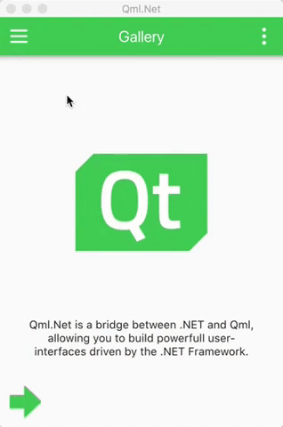

Since Microsoft anounced .NET Core, there hasn't been a clear vision vision on what cross-platform GUI development would look like. Although they plan to support WPF in .NET Core 3.0, it will still only target Windows.

There have been many different projects that have proped up that have attempted to fill the void, but (IMO) have come up short. They typically have one or more of the following issues:

1. Too young, not enough controls. Particularly with projects that render their own components.
3. Lack of styling/customizations. Particularly with projects that wrap native controls which don't support advanced styling scenarios.
2. Too "PInvoke chatty". Some projects attempt to render their own controls in .NET which require many calls to correctly draw the 2D scenes. It is expensive to call into native libraries. It is because of this reason that Microsoft created ```PresentationFramework.dll``` for WPF which handles most of the DirectX calls while exposing the key peices needed to render controls in .NET/WPF.

# Using an existing GUI framework

It is always nice to stand on the shoulder of giants. Wouldn't you rather implement your GUI on something that has been battle tested in the field for years in many different fields?

**GTK** - It supports many platforms, including embedded architectures. It is also written in C which makes interopping with C# considerablly easier than C++. However, this isn't a good candidate for C#/.NET for a few reasons. While the controls look great under Linux, they look alien on OSX and Windows. Considering the APIs that would need to be exposed to .NET to build a fully-featured application, it would take a considerable amount of effort to develop/maintain and would increase your surface area for bugs. Also, it would suffer from the "chatty PInvoke" issue mentioned previously, especially when rendering your own controls.

**Qt Widgets** - This would also suffer similar problems that GTK faces. It is written in C++ which makes it particularly hard to interop with from C#. Qt Widgets is also considered the "old-way" of doing things. QML/QtQuick is the recommended approach by the Qt team for new projects.

**Qt/QML/QtQuick** - This is the best option. The UI is entirely written and defined in QML, which removes any "chatty PInvoke" issues. It would also not require you to wrap an extensive API since everything is done in QML. It has great styles that mimick native controls on each platform (Windows/OSX/Linux/Android/iOS).

# The current landscape

**GtkSharp** - This is great wrapper. It still suffers from chatty PInvoke though when doing any custom rendering. It also looks alien on OSX and Windows.

**QtSharp** - This project attempts to wrap Qt and the Qt Widgets. It auto-generates it's C# wrappers which makes it easier to wrap the large API surface needed to build an application. However, it is still trying to wrap a C++ api (using MonoCpp), and because of this, it is plagued with issues (name mangling, object ownership semantics, the MOC/signal system, portability). It also attempts to wrap the entire Qt API, even when there are comparable .NET types/libraries. It also only supports Qt Widgets, which is considered the "old way" of doing things.

# Introducing my project, Qml.Net

[Qml.Net](https://github.com/pauldotknopf/Qml.Net)

Qml.Net is a C# library with a native dependency that exposes the required types needed to host a QML engine. The PInvoke code is hand-crafted to to ensure proper memory mangement and owner-ship semantics. I'd bet you could't generate a segfault, even if you wanted to.

You can register C# objects to be treated as QML components that you can interop with as if they are regular JS objects. These registered objects serve as the portal into which the QML world can interact with your .NET objects. This has the added benefit of enforcing you to keep to keep your business/UI concerns seperated cleanly along the tech stacks, and no chatty PInvoke calls for rendering. It truely is a mariage made in heaven!

A pre-compiled portable installation of Qt and the native C wrapper is available for Windows, OSX and Linux. Developers shouldn't have to touch C/C++. All you need to know is QML (json-like), JavaScript and C#. Pluralsight has a great course for QML/QtQuick [here](https://www.pluralsight.com/courses/qt-quick-fundamentals).

The best way to get an idea of what this all looks like is to check out [the examples](https://github.com/pauldotknopf/Qml.Net.Examples).

:::featured-image

:::

I'm really excited about this approach for building cross-platform apps with C#. Please give it a shot and leave me some feedback!